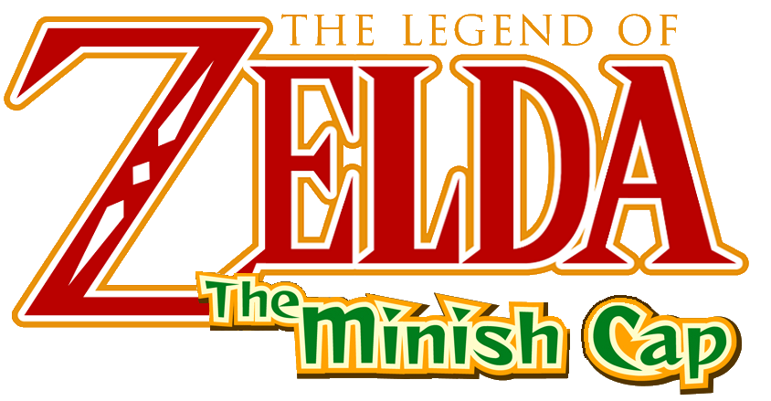

# The Minish Cap 3DS



Native Nintendo 3DS dual-screen port of *The Legend of Zelda: The Minish Cap*,
built with help from Codex.

This project is based on open-source work from:

- Direct dual-screen Android source base:
  [samyost1/tmc-android](https://github.com/samyost1/tmc-android)
- Native Minish Cap engine and port infrastructure:
  [Project Picori](https://github.com/999sian/tmc)
- Original decompilation:
  [zeldaret/tmc](https://github.com/zeldaret/tmc)

No ROM or extracted game asset package is distributed in this repository. Each
user must provide their own legally obtained compatible Game Boy Advance ROM on
their own 3DS SD card.

## Features

- Native 3DS port with installable CIA and Homebrew Launcher 3DSX
  builds.
- Fullscreen top-screen gameplay at 360x240 with nearest-neighbor scaling.
- Bottom screen with live map, dungeon information, quest status and touch item
  UI.
- PICA200/Citro2D presentation for the top and bottom screens.
- Parallel software PPU rendering across the available 3DS application cores.
- New Nintendo 3DS speedup with 804 MHz, L2 cache and third-core rendering
  support.
- Local save data stored beside the ROM on the SD card.

## Installation

1. Install `tmc-3ds-v0.1.0.cia` with FBI, or copy the 3DSX build to the
   Homebrew Launcher.
2. Create this directory on the SD card:

```text
sdmc:/3ds/The Minish Cap 3DS/
```

3. Place your clean USA ROM in that directory. Any `.gba` filename is accepted,
   though short names are recommended.

The expected ROM SHA-1 is:

```text
b4bd50e4131b027c334547b4524e2dbbd4227130
```

The ROM stays on your SD card and is never included in the CIA.

Audio requires a working 3DS DSP firmware setup. On Luma3DS, use Rosalina's
`Dump DSP firmware` option if homebrew audio is unavailable.

## Releases

Every GitHub release includes:

- installable CIA
- Homebrew Launcher 3DSX
- QR code for scanning the CIA URL from FBI on a 3DS
- clean source-code zip for that exact version

## Building

Requirements:

- devkitPro with devkitARM, libctru, Citro2D, and Citro3D
- CMake and the devkitPro Nintendo 3DS toolchain
- `makerom` and `bannertool` for CIA packaging

Build:

```sh
chmod +x platform/3ds/build.sh
./platform/3ds/build.sh
```

Outputs are written to:

```text
build-3ds/game/tmc-3ds-v0.1.0.cia
build-3ds/game/tmc-3ds-v0.1.0.3dsx
```

The build does not embed a ROM.

## Credits

- [samyost1/tmc-android](https://github.com/samyost1/tmc-android) - direct
  dual-screen Android source base for this 3DS port.
- [Project Picori](https://github.com/999sian/tmc) - native Minish Cap engine,
  software PPU, and port infrastructure.
- [Raekwon1603/tmc-android](https://github.com/Raekwon1603/tmc-android) - Android
  packaging and platform work behind the dual-screen fork.
- [zeldaret/tmc](https://github.com/zeldaret/tmc) - original decompilation.
- Esteban PDN - Nintendo 3DS port and release maintenance.

## License And Legal Notice

Source code is distributed under GPL-3.0; see [LICENSE](LICENSE). Third-party
components retain their respective compatible licenses as listed in
[THIRD-PARTY-LICENSES.md](THIRD-PARTY-LICENSES.md).

Nintendo owns *The Legend of Zelda*, *The Minish Cap*, and all associated game
content. This is an unofficial fan-made port. No Nintendo ROM, extracted game
asset package, save data, or firmware is distributed by this project.
